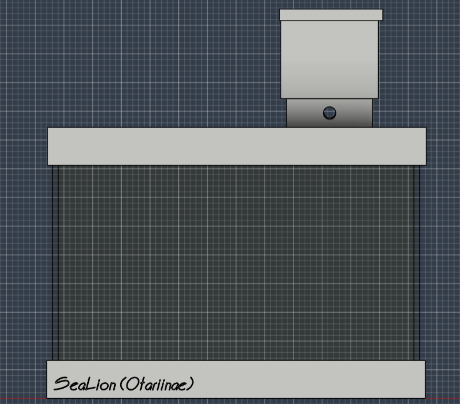
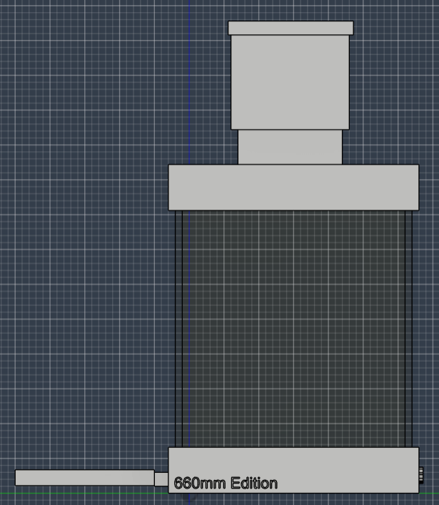
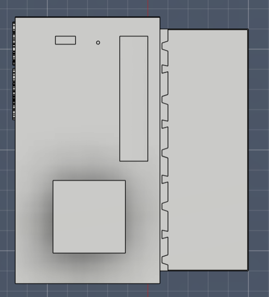
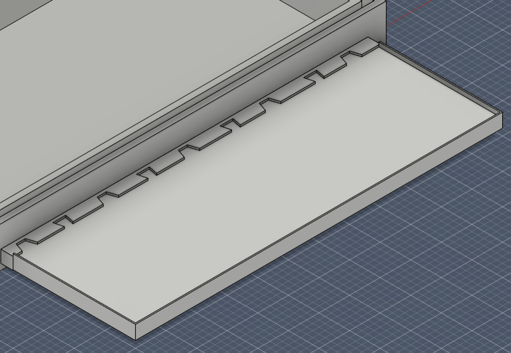
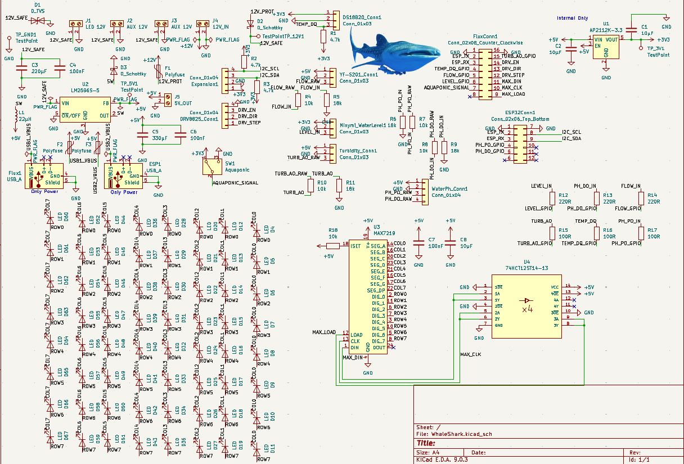
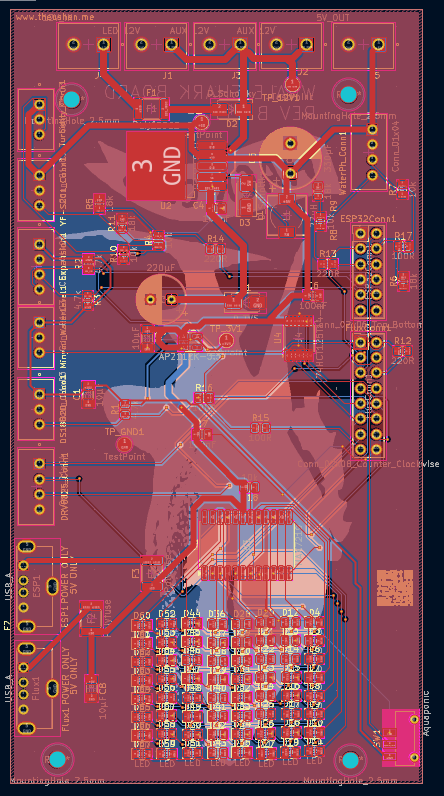
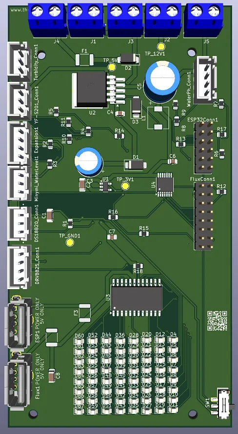
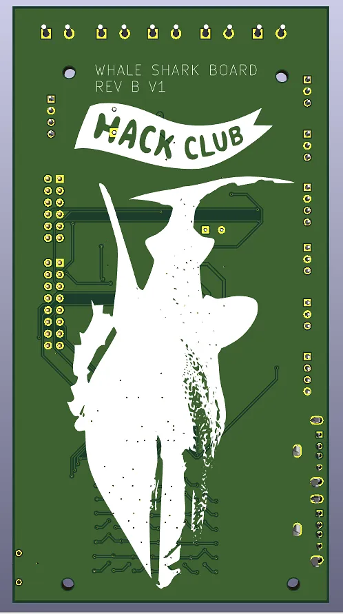

# SeaLion (Otariinae)

SeaLion is my smart aquarium project. It started as “automate a few aquarium tasks” and turned into a full embedded system: custom PCB, separate controller boards, 3D structure, telemetry, relay control, local logging, aquaponics expansion, and a visual status matrix.

The project is intentionally split into two boards:

- **WhaleShark**: the main **ESP32** board that handles Wi‑Fi, API, time sync, automation, and system orchestration.
- **Flux**: the auxiliary **RP2040** board that handles local relays, the **MAX7219 8×8 matrix**, MicroSD logging, and hardware-side failsafe behavior.

I did it this way on purpose. I wanted networking and high-level logic on the main board, while the second board stays focused on the things that need to remain deterministic and safe near the hardware.

---

## What this project does

The goal is to keep the aquarium stable with as little manual work as possible.

That includes:

- continuous circulation
- water and environment monitoring
- relay control for pumps and other loads
- a local matrix display for loading, timers, warnings, and system state
- aquaponics expansion support
- local MicroSD logging
- remote control and telemetry through an HTTP API
- internet time sync through the ESP32 instead of an RTC on Flux

The aquaponics expansion in V1 is simple on purpose. It is basically a switchable timed peristaltic pump that pulls water from the aquarium and waters the plants. That logic lives in the automation layer and runs through a dedicated Flux relay output.

---

## Architecture

| Block | Controller | Role |
|---|---|---|
| WhaleShark | ESP32 | Wi‑Fi, API, NTP, automation, sensor aggregation, policy |
| Flux | RP2040 | Relay control, MAX7219 rendering, MicroSD logging, failsafe |
| Matrix | MAX7219 | Boot animations, status icons, scrolling text, timers |
| Aquaponics module | Flux relay output | Timed watering of the plant bed |

### Why this split exists

The ESP32 is the system brain. It is much better for:

- network access
- NTP time synchronization
- exposing an API
- coordinating all modules
- future dashboard integration

Flux is the hardware-side executor. It is better for:

- direct relay outputs
- keeping outputs alive in a safe state if the main board disappears
- driving the matrix without blocking the network stack
- logging locally on MicroSD

That separation also helps wiring. The noisy hardware can stay near the board that is meant to switch it.

---

## MAX7219 matrix

Flux controls an **8×8 matrix through the MAX7219**.

This matrix is not just decorative. It is used to display:

- loading during boot
- Wi‑Fi / ready / alert states
- timer countdowns
- short scrolling messages
- icons for pump, water, warning, and plant state

The firmware maps the matrix logically according to the schematic convention you used:

- rows: `ROW0` to `ROW7`
- columns: `COL7` to `COL0`

That means the firmware intentionally mirrors the logical X axis so the matrix behaves like the schematic view instead of whatever random hardware orientation would otherwise appear on the first try.

---

## Current V1 behavior

### Main aquarium pump

The main circulation pump is treated as a **normally-on output**.

That is the safest default for keeping water moving and helping filtration and oxygen exchange. In automatic mode, the firmware keeps it enabled unless there is a condition that strongly suggests protecting hardware from dry run, such as a low-level alarm.

### Aquaponics pump

The aquaponics expansion is handled by a dedicated Flux relay.

Default V1 policy:

- enabled during daytime window
- runs in short timed pulses
- skipped if the aquarium is in a low-level condition
- controlled by WhaleShark, switched by Flux

Those values are easy to change in the config files once the real flow rate is tested.

---

## Firmware layout

### WhaleShark / ESP32

Main responsibilities:

- connect to Wi‑Fi
- sync time from NTP
- read local sensors
- decide relay states
- expose HTTP API endpoints
- optionally protect endpoints with an API secret
- send commands and time updates to Flux over I2C

Important files:

- `firmware/ESP32/include/pins.h`
- `firmware/ESP32/include/config.h`
- `firmware/ESP32/src/main.cpp`

### Flux / RP2040

Main responsibilities:

- receive commands from WhaleShark over I2C
- drive relays
- drive the MAX7219 matrix
- log to MicroSD
- keep safe defaults if communication is lost

Important files:

- `firmware/RP2040(Flux)/include/pins.h`
- `firmware/RP2040(Flux)/include/config.h`
- `firmware/RP2040(Flux)/src/main.cpp`

Protocol notes:

- `firmware/PROTOCOL.md`

Board-to-board wiring notes:

- `docs/CONNECTIONS_FLUX_TO_WHALE.md`

---

## API

WhaleShark exposes a small V1 HTTP API.

Implemented endpoints:

- `GET /api/v1/ping`
- `GET /api/v1/status`
- `GET /api/v1/sensors`
- `POST /api/v1/mode?value=auto|manual|maintenance`
- `POST /api/v1/relay?name=main_pump|aquaponics|spare1|spare2&state=on|off`
- `POST /api/v1/matrix/text?text=HELLO`
- `POST /api/v1/matrix/timer?seconds=90`

### Optional secret

A V1 dashboard does not exist yet, but the firmware already supports an optional API secret.

Set `API_SECRET` in:

- `firmware/ESP32/include/config.h`

If it is set, requests must include:

- `X-API-Key: <your secret>`

If it is left empty, the API is open on the local network.

---

## Inter-board connection

The recommended connection for V1 is:

- I2C
- one interrupt/status line
- one enable/maintenance line
- shared ground
- 5V power from a single source

Recommended mapping:

| WhaleShark (ESP32) | Flux (RP2040) | Purpose |
|---|---|---|
| GPIO21 | GPIO4 | I2C SDA |
| GPIO22 | GPIO5 | I2C SCL |
| GPIO27 | GPIO14 | Flux interrupt / status |
| GPIO26 | GPIO15 | Flux enable / maintenance |
| 5V | VBUS / 5V in | power |
| GND | GND | common reference |

More detail is in:

- `docs/CONNECTIONS_FLUX_TO_WHALE.md`

---

## Mechanical side

The physical design uses a printed upper and lower structure with an acrylic middle body, mounting points, and space for cables, sensors, pumps, and boards.

### Structure 3D

  
  
  

### Electrical bay

  

---

## PCB

### Schematic

  

### Layout

  

### Board 3D renders

  
  

---

## Notes about calibration

The firmware already includes the structure for:

- pH
- TDS
- turbidity
- water level
- water temperature

The analog conversions are present as practical V1 defaults, but they still need final real-world calibration against the exact probes and boards used in the hardware.

That part is normal. The project can boot, talk, switch, and show state without final calibration, but trustworthy chemistry values need calibration with the physical sensors.

---

## V1 priorities

The current focus is not a cloud product. The priority is:

1. boot reliably
2. connect both boards
3. read sensors
4. keep the aquarium alive safely
5. show useful local feedback on the matrix
6. expose a usable local API
7. leave room for a future dashboard

That is the point of this revision: get a strong first real hardware/software foundation instead of pretending the hard parts do not exist.

https://stpeter.im/writings/essays/publicdomain.html